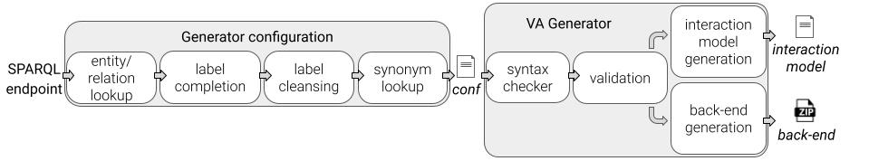
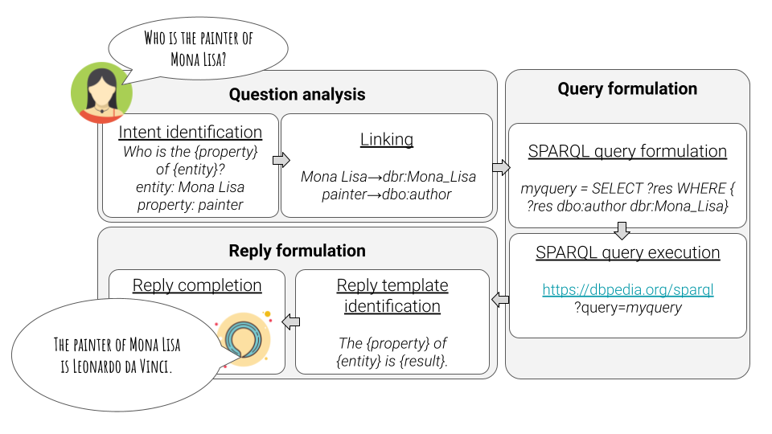

# Automatic Skill Generation for Knowledge Graph Question Answering

It is a webpage presenting a community shared software framework to create custom extensions to query knowledge graphs by virtual assistants, unlocking the potentialities of the Semantic Web technologies by bringing knowledge graphs in the _"pocket"_ of everyone, accessible from smartphones or smart speakers. 

The source code and documentation of the proposed generator is provided on 
[GitHub](https://github.com/mariaangelapellegrino/virtual_assistant_generator) and on [Zenodo](https://doi.org/10.5281/zenodo.4605951).

## The generator architecture

The implemented process is graphically represented in figure. 
.

1. The generator takes as input a **configuration file**, which defines:
- the *SPARQL endpoint* of interest
- desired *language* (en and it are supported at the moment)
- the *invocation name* (i.e., the skill wake-up word)
- the list of *desired intents*.
- *entity and realtion dictionaries*
2. The generator checks the **syntactical correctness** of the configuration file during the syntax checker phase.
3. It validates the **semantic correctness** of the configuration during the validation.
4. During the **interaction model generation**, it creates the interaction\_model.json which contains configured intents, its utterances and the slot values as defined in the configuration file.
5. During the **back-end generation** phase, it produces the back-end (as ZIP file) containing the back-end logic implementation.

If any error occurs, the generator immediately stops and returns a message reporting the occurred error. If the configuration is properly provided, the generator returns a folder entitled as the skill wake-up word containing the interaction model as JSON file and the back-end Node.js code as a ZIP file. The generated skill is ready to be used, i.e., it can automatically be uploaded on Amazon developer and Amazon AWS, respectively. It corresponds to manually created skills, but our proposal may reduce required technical competencies and development time. 

### Supported intents

The implemented intents are tailored towards SPARQL constructs, and they cover SELECT and ASK queries, class specification, numeric filters, order by to get the superlative and path traversal.

We model each supported SPARQL query template as an intent. Each intent is modelled by a set of utterances and can be completed by slot values. A custom slot represents each slot, and it requires the specification of a (complete or partial) set of values that it can assume.

### Configuration options: *manual VS automatic*

According to users' skills, they can provide the generator with a custom configuration file. Otherwise, they can exploit the **generator configuration** component that takes as input the SPARQL endpoint of interest, automatically retrieves both classes and relations labels and their URIs, and returns the configuration file that can be directly used to initialize the VA generator.

## Virtual Assistant Extension Usage

In a Virtual Assistant-based process (as in Fig.), 
1. Users pose a question in NL by pronouncing or typing it via a VA app or dedicated device (e.g., Alexa app/device);
2. Virtual Assistants are provided with a Natural Language processing component performing the **question analysis** task, which includes
- **_intent identification_** to recognize the intent matching user's request and solving intents slots;
- **_linking_** task to determine URIs corresponding to entities and relations labels. It can be accomplished by consulting a lookup dictionary or by calling an API service, at the moment.
3. The Virtual Assistant extension back-end performs the **query formulation** task which is based on
- **_SPARQL query formulation_** to transform the user question in a SPARQL query,
- **_SPARQL query execution_** to run the SPARQL query over the configured SPARQL endpoint.
4. The Virtual Assistant extension back-end performs the **reply formulation** task where
- the **_reply template identification_** phase aims to recognize the template to return the Natural Language reply,
- during the **_reply completition_**, the reply template is complited by actual results.
5. The reply is returned to the user.

## Use cases

we propose a generic approach and we openly publish Virtual Assistant extensions for general purpose KGs (such as DBpedia and Wikidata) and Cultural Heritage Knowledge Graphs.
[Use cases](https://github.com/mariaangelapellegrino/virtual_assistant_generator/tree/master/use_cases) are available on GitHub and Zenodo.

## Demo

A [complete demo](./demo.md) to use the generator and the generated skill on DBpedia is freely available.

## Citation

This webpage behaves as a support material for the demo paper entitled _Automatic Skill Generation for Knowledge Graph Question Answering_, authored by Maria Angela Pellegrino, Mario Santoro, Vittorio Scarano, Carmine Spagnuolo (Univerità degli Studi di Salerno, Italy), at ESWC 2021. 